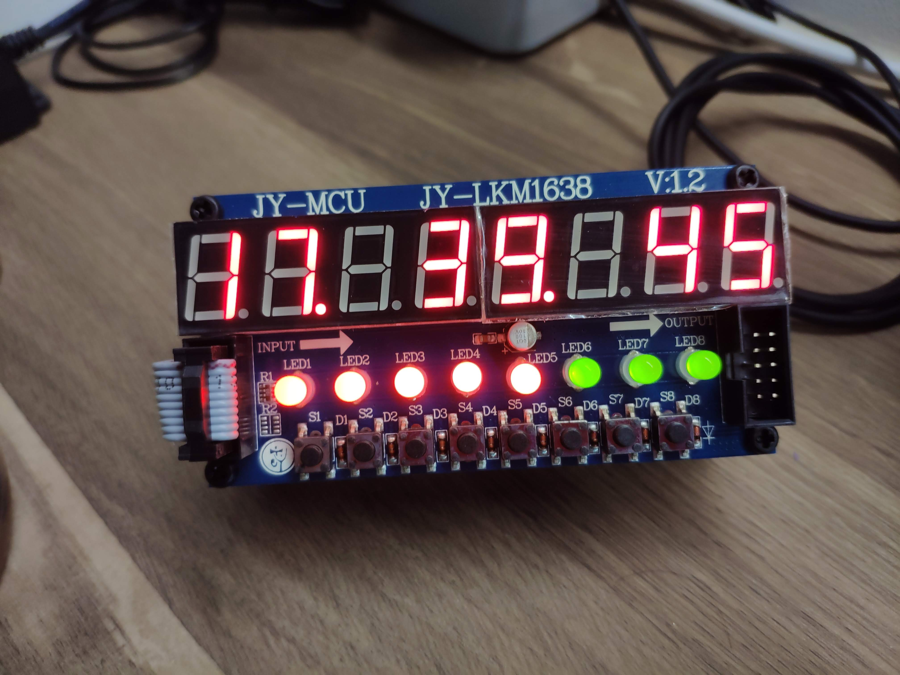
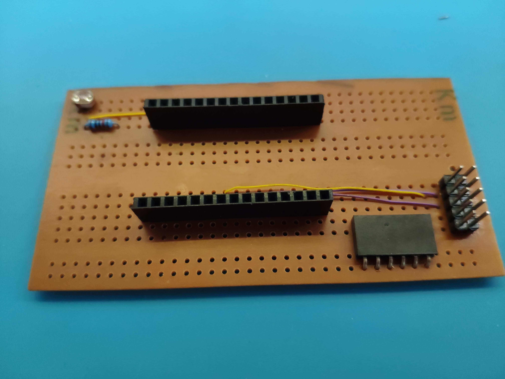
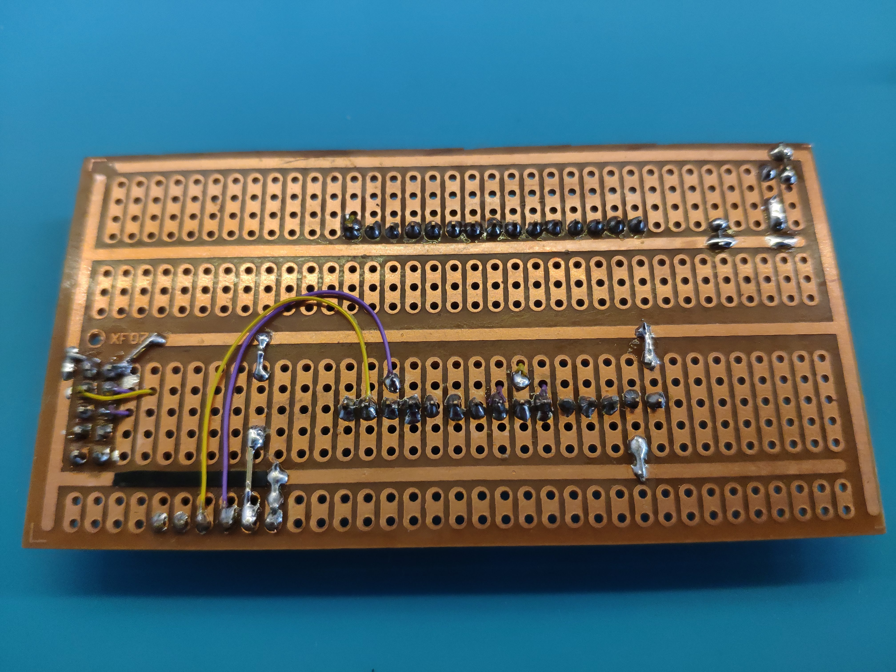
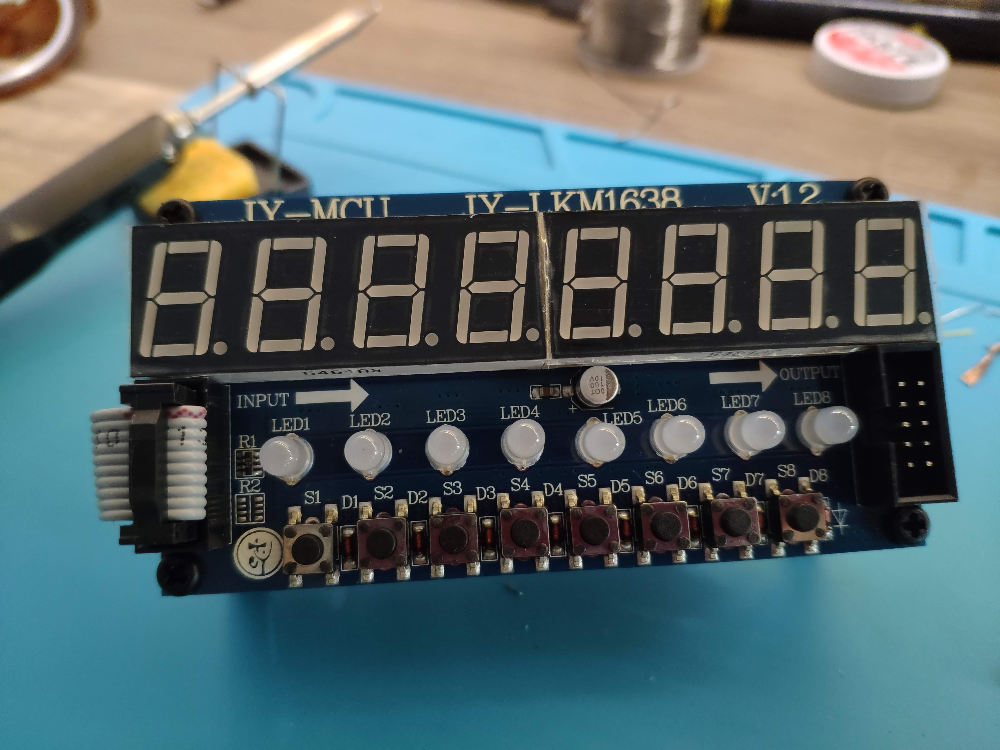
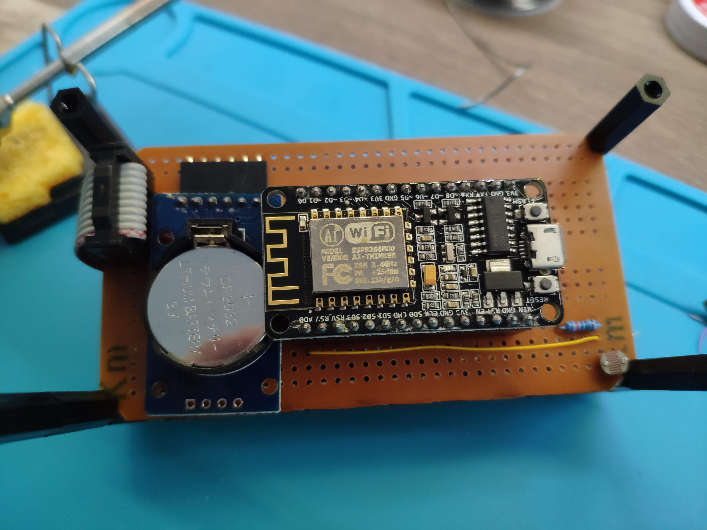

# JY-LKM1638 WiFi Clock

<figure>
  
</figure>

This is an ESP8266-based clock with RTC and NTP time sync using the JY-LKM1638 module. I made this to learn how to use Arduino libraries for RTC, NTP, WiFi connectivity and OTA updates.

## Features
- ESP8266 for internet connectivity
- [WiFiManager](https://github.com/tzapu/WiFiManager) for dynamic WiFi configuration and web-based settings portal 
- ArduinoOTA for updates
- NTP connection for accurate timekeeping and updating RTC
- RTC fallback when WiFi/NTP not available
- Auto brightness with LDR

## Software

### Interface

After connecting via WiFiManager and captive portal, you can set the GMT offset by clicking on the "Settings" button.

|   |
|:--:|
| *Defaults to GMT+8 because that's how it is in Singapore. Ignore the "Sensor Timeout" as this screenshot is taken from a newer nixie clock build with a PIR sensor.*  |

### Environment

I developed with VSCode and the PlatformIO extension, but you can easily pull the libraries in [platformio.ini](platformio.ini) yourself if you prefer to use something else.

### Brightness

The brightness of the LED segments in the JY-LKM1638 can be adjusted, so it can be dimmed in dark conditions to make it more comfortable to look at. Brightness is dynamically set using the LDR which uses the minimum and maximum detected brightness over time to normalize and set the current brightness value. In addition, as I found that sometimes the brightness changes too abruptly, I added some smoothing to the LDR value before setting the brightness:

```
void setBrightness()
{
    const auto currentLDR = analogRead(LDR_PIN);

    if (currentLDR < ldrMin)
        ldrMin = currentLDR;

    if (currentLDR > ldrMax)
        ldrMax = currentLDR;

    //https://makeabilitylab.github.io/physcomp/advancedio/smoothing-input.html
    static const float EWMA_ALPHA = 0.1; // the EWMA alpha value (α)
    static double ewmaLDR = currentLDR; // the EWMA result (Si), initialized to first brightness value

    ewmaLDR = (EWMA_ALPHA * currentLDR) + (1 - EWMA_ALPHA) * ewmaLDR; // Apply the EWMA formula

    //Fallback for LDR not attached
    if (currentLDR == 0 && ldrMin == 0 && ldrMax == 0)
        brightness = 4;
    else
        brightness = map(ewmaLDR, ldrMin, ldrMax, TM1638_BRIGHTNESS_MIN, TM1638_BRIGHTNESS_MAX);

    lkm1638.setBrightness(brightness);
}
```

## Hardware

I designed it as a modular, 2 layer stack. The bottom stack consists of the supporting circuitry and the top stack is the JY-LKM1638. The stripboard I used happens to be very close to the size of the JY-LKM1638 and can be mounted with standoffs after trimming off the corners.

### BOM
- NodeNCU ESP826: MCU and internet connectivity
- JY-MCU JY-LKM1638: 8 digit, 7-segment display, 8 dual coloured LEDs, and 8 buttons
- DS3231 RTC
- LDR and resistor
- Misc: stripboard, headers, wires (I used wire wrap wires)

### Building

|  | 
|:--:| 
| *Headers soldered to the stripboard. On the upper left corner you can also see the LDR and resistor.* |

|  | 
|:--:| 
| *Bottom view of the above.* |

|  | 
|:--:| 
| *The JY-LKM1638 board as the top stack. You can daisy chain a few of them using the ribbon cable too* |

|  | 
|:--:| 
| *Mounting modules to the bottom stack. On the left is the ribbon cable from the JY-LKM1638 to interface with the MCU. In the middle is the DS3231 module for timekeeping when not plugged into power. The CR2032 coin cell is visible. The NodeMCU provides the computation and internet connectivity with the Expressif ESP8266 chip.* |

|  | 
|:--:| 
| *Dual colour LEDs with waterfall animation* |

|  | 
|:--:| 
| *With my HPDL-1414 clock (above)* |